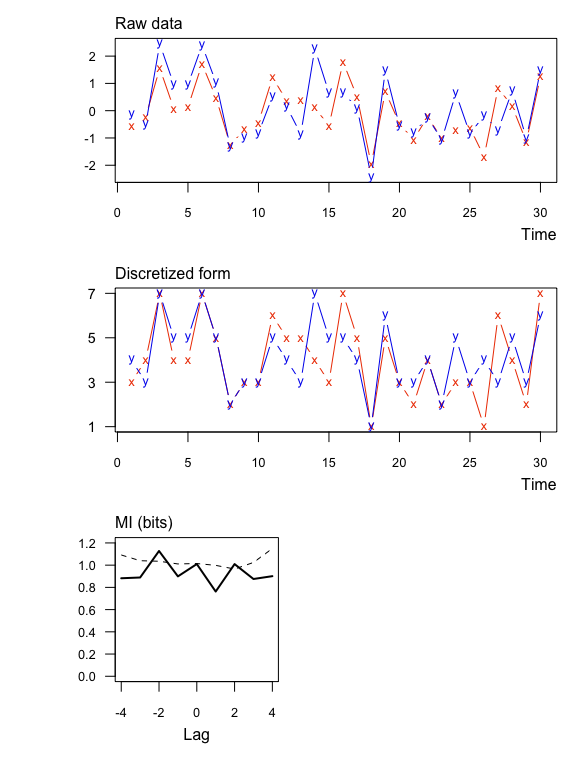
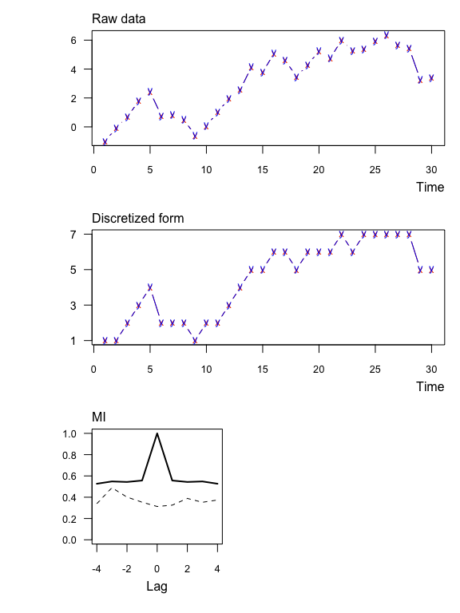

muti
====

`muti` is an `R` package that computes the mutual information (MI) between two discrete random variables *X* and *Y*. `muti` was developed with time series analysis in mind, but there is nothing tying the methods to a time index *per se*.

You can install the development version using `devtools`.

    if(!require("devtools")) {
      install.packages("devtools")
      library("devtools")
    }
    devtools::install_github("mdscheuerell/muti")

Background
----------

MI estimates the amount of information about one variable contained in another; it can be thought of as a nonparametric measure of the covariance between the two variables. MI is a function of entropy, which is the expected amount of information contained in a variable. If *P*(*X*) is the probability mass function of *X*, then the entropy of *X* is

*H*(*X*) = E\[-ln(P(X))\].

The MI between *X* and *Y* is then

MI(*X*,*Y*) = *H*(*X*) + *H*(*Y*) - *H*(*X*,*Y*)

where *H*(*X*,*Y*) is the joint entropy between *X* and *Y*.

Data discretization
-------------------

`muti` computes MI based on 1 of 2 possible discretizations of the data:

1.  **Symbolic**. In this case the *i*-th datum is converted to 1 of 5 symbolic representations (*i.e.*, "peak", "decreasing", "same", "trough", "increasing") based on its value relative to the *i*-1 and *i*+1 values (see [Cazelles 2004](https://doi.org/10.1111/j.1461-0248.2004.00629.x) for details). Thus, the resulting symbolic vector is 2 values shorter than its original vector. For example, if the original vector was `c(1.2,2.1,3.3,1.1,3.1,2.2)`, then its symbolic vector for values 2-5 would be `c("increasing","peak","trough","peak")`.

2.  **Binned**. In this case each datum is placed into 1 of *n* equally spaced bins. If the number of bins is not specified, then it is calculated according to Rice's Rule whereby `n = ceiling(2*length(x)^(1/3))`.

Examples
--------

The primary output of `muti` is a data frame with the MI `MI_xy` and respective significance threshold `MI_ci` at different lags. Additionally, `muti` produces plots of the original data, symbolic data (if that option is chosen), and the MI values and associated critical value at different lags.

### Ex 1: Real values as symbolic

Here's an example with significant correlation between two numeric vectors. Notice that none of the symbolic values are the "same".

``` r
set.seed(123)
TT <- 30
x <- rnorm(TT)
y <- x + rnorm(TT)
muti(x,y)
```


    ##       lag     MI_xy     MI_ci
    ##  [1,]  -4 0.3122401 0.6396689
    ##  [2,]  -3 0.5477111 0.5896470
    ##  [3,]  -2 0.4896244 0.5868193
    ##  [4,]  -1 0.6133082 0.5400706
    ##  [5,]   0 0.7759290 0.6117563
    ##  [6,]   1 0.4590565 0.6097824
    ##  [7,]   2 0.1663024 0.5748355
    ##  [8,]   3 0.2815102 0.5654351
    ##  [9,]   4 0.4795740 0.6188139

### Ex 2: Integer values as symbolic

Here's an example with significant correlation between two integer vectors.

``` r
x <- rpois(TT,4)
y <- x + sample(c(-1,1),TT,replace=TRUE)
muti(x,y)
```


    ##       lag     MI_xy     MI_ci
    ##  [1,]  -4 0.9622210 0.8510187
    ##  [2,]  -3 0.5323156 0.7538786
    ##  [3,]  -2 0.4511814 0.7758370
    ##  [4,]  -1 0.7775874 0.7009295
    ##  [5,]   0 0.9852553 0.6586393
    ##  [6,]   1 0.9450356 0.7456378
    ##  [7,]   2 0.5661902 0.8078943
    ##  [8,]   3 0.6119224 0.8451717
    ##  [9,]   4 0.7026058 0.8197471

### Ex 3: Correlated variables with binning

Same as Ex 2 with regular binning instead of symbolic.

``` r
muti(x,y,sym=FALSE)
```


    ##       lag     MI_xy     MI_ci
    ##  [1,]  -4 0.7205602 0.7761311
    ##  [2,]  -3 0.9526708 0.7018589
    ##  [3,]  -2 0.4997216 0.7832170
    ##  [4,]  -1 0.6950575 0.6192060
    ##  [5,]   0 1.1541215 0.6115371
    ##  [6,]   1 0.5383688 0.6809030
    ##  [7,]   2 0.7728422 0.6816846
    ##  [8,]   3 0.7183452 0.7091359
    ##  [9,]   4 0.4081389 0.8035495

### Ex 4: Correlated variables as symbolic with normalized MI

Same as Ex 2 with MI normalized to \[0,1\]. In this case MI'(*X*,*Y*) = MI(*X*,*Y*)/sqrt(*H*(*X*)\**H*(*Y*)).

``` r
muti(x,y,normal=TRUE)
```



    ##       lag     MI_xy     MI_ci
    ##  [1,]  -4 0.4661998 0.4022972
    ##  [2,]  -3 0.2545601 0.4053128
    ##  [3,]  -2 0.2180167 0.3969374
    ##  [4,]  -1 0.3699019 0.3913088
    ##  [5,]   0 0.4813746 0.3528764
    ##  [6,]   1 0.4460337 0.3497386
    ##  [7,]   2 0.2737760 0.3790230
    ##  [8,]   3 0.2885335 0.4179139
    ##  [9,]   4 0.3359142 0.4310782

### Ex 5: Correlated variables at

Here's an example of examining the MI of a single time series at multiple time lags.

``` r
x <- cumsum(rnorm(TT))
muti(x[-TT],x[-1],sym=FALSE)
```



    ##       lag     MI_xy     MI_ci
    ##  [1,]  -4 0.8530202 0.8320115
    ##  [2,]  -3 1.0554051 1.0469995
    ##  [3,]  -2 1.2159387 1.0047938
    ##  [4,]  -1 1.5020663 1.1035966
    ##  [5,]   0 1.5210534 0.8228241
    ##  [6,]   1 2.5210688 1.2331335
    ##  [7,]   2 1.4950352 1.0766605
    ##  [8,]   3 1.4501998 1.1974625
    ##  [9,]   4 1.1534112 1.0277111
