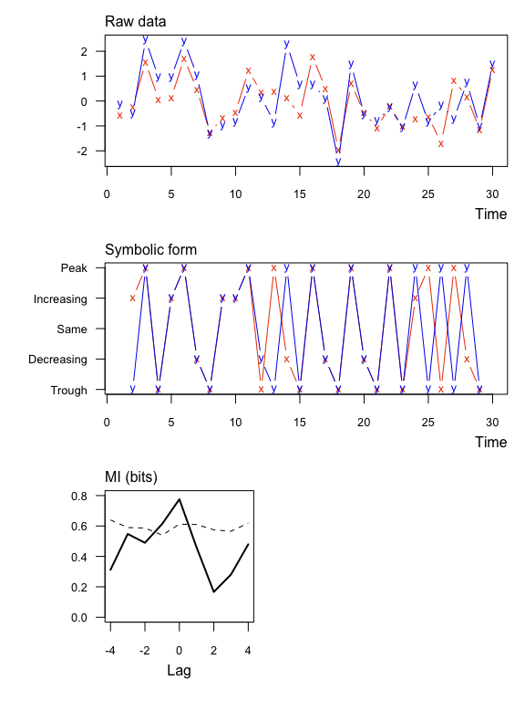
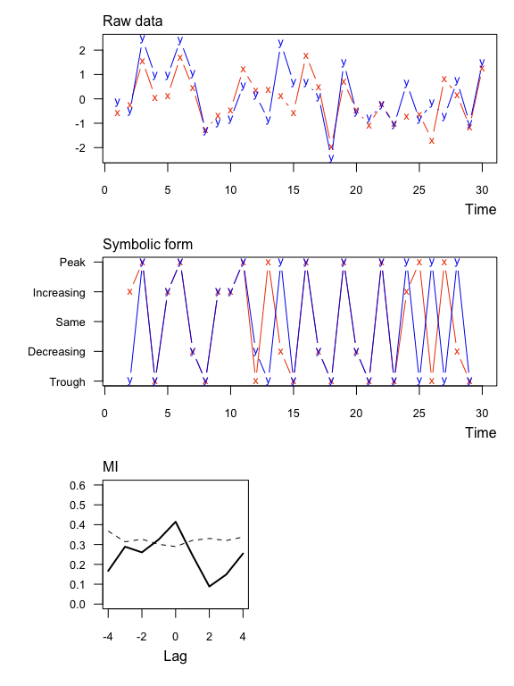

[](https://travis-ci.org/mdscheuerell/muti)

muti
====

`muti` is an `R` package that computes the mutual information (MI) between two discrete random variables *X* and *Y*. `muti` was developed with time series analysis in mind, but there is nothing tying the methods to a time index *per se*.

[](https://zenodo.org/badge/latestdoi/85351399)

Installation
------------

You can install the development version using `devtools`.

    if(!require("devtools")) {
      install.packages("devtools")
      library("devtools")
    }
    devtools::install_github("mdscheuerell/muti")

Background
----------

MI estimates the amount of information about one variable contained in another; it can be thought of as a nonparametric measure of the covariance between the two variables. MI is a function of entropy, which is the expected amount of information contained in a variable. The entropy of *X*, *H*(*X*), given its probability mass function, *P*(*X*), is

*H*(*X*) = E\[-ln(P(X))\].

The MI between *X* and *Y* is then

MI(*X*,*Y*) = *H*(*X*) + *H*(*Y*) - *H*(*X*,*Y*)

where *H*(*X*,*Y*) is the joint entropy between *X* and *Y*. `muti` uses base-2 logarithms for calculating the entropies, so MI measures information content in units of "bits".

Data discretization
-------------------

`muti` computes MI based on 1 of 2 possible discretizations of the data in a vector `x`:

1.  **Symbolic**. (Default) For `1 < i < length(x)`, `x[i]` is translated into 1 of 5 symbolic representations based on its value relative to `x[i-1]` and `x[i+1]`: "peak", "decreasing", "same", "trough", or "increasing". For example, if the original vector was `c(1.1,2.1,3.3,1.2,3.1)`, then its symbolic translation would be `c("increasing","peak","trough")`. For additional details, see [Cazelles (2004)](https://doi.org/10.1111/j.1461-0248.2004.00629.x).

2.  **Binned**. Each datum is placed into 1 of *n* equally spaced bins as in a histogram. If the number of bins is not specified, then it is calculated according to Rice's Rule where `n = ceiling(2*length(x)^(1/3))`.

I/O
---

**Input**. At a minimum `muti` requires two vectors of class `numeric` or `integer`. See `?muti` for all of the other function arguments.

**Output**. The output of `muti` is a data frame with the MI `MI_xy` and respective significance threshold value `MI_tv` at different lags. Note that a negative (positive) lag means *X* leads (trails) *Y*. For example, if `length(x) == length(y) == TT`, then the MI in `x` and `y` at a lag of -1 would be based on `x[1:(TT-1)]` and `y[2:TT]`.

Additionally, `muti` produces a 3-panel plot of

1.  the original data (top);
2.  their symbolic or discretized form (middle);
3.  MI values (solid line) and their associated threshold values (dashed line) at different lags (bottom).

The significance thresholds are based on bootstraps of the original data. That process is relatively slow, so please be patient if asking for more than the default `mc=100` samples.

Examples
--------

### Ex 1: Real values as symbolic

Here's an example with significant information between two numeric vectors. Notice that none of the symbolic values are the "same".

``` r
set.seed(123)
TT <- 30
x1 <- rnorm(TT)
y1 <- x1 + rnorm(TT)
muti(x1, y1)
```



    ##   lag MI_xy MI_tv
    ## 1  -4 0.312 0.640
    ## 2  -3 0.548 0.590
    ## 3  -2 0.490 0.587
    ## 4  -1 0.613 0.540
    ## 5   0 0.776 0.612
    ## 6   1 0.459 0.610
    ## 7   2 0.166 0.575
    ## 8   3 0.282 0.565
    ## 9   4 0.480 0.619

### Ex 2: Integer values as symbolic

Here's an example with significant information between two integer vectors. Notice that in this case some of the symbolic values are the "same".

``` r
x2 <- rpois(TT,4)
y2 <- x2 + sample(c(-1,1), TT, replace = TRUE)
muti(x2, y2)
```


    ##   lag MI_xy MI_tv
    ## 1  -4 0.962 0.851
    ## 2  -3 0.532 0.754
    ## 3  -2 0.451 0.776
    ## 4  -1 0.778 0.701
    ## 5   0 0.985 0.659
    ## 6   1 0.945 0.746
    ## 7   2 0.566 0.808
    ## 8   3 0.612 0.845
    ## 9   4 0.703 0.820

### Ex 3: Real values as symbolic with normalized MI

Here are the same data as Ex 1 but with MI normalized to \[0,1\] (`normal = TRUE`). In this case MI'(*X*,*Y*) = MI(*X*,*Y*)/sqrt(*H*(*X*)\**H*(*Y*)) and the units are dimensionless.

``` r
muti(x1, y1, normal = TRUE)
```



    ##   lag MI_xy MI_tv
    ## 1  -4 0.167 0.368
    ## 2  -3 0.289 0.314
    ## 3  -2 0.260 0.327
    ## 4  -1 0.325 0.301
    ## 5   0 0.414 0.290
    ## 6   1 0.246 0.321
    ## 7   2 0.088 0.331
    ## 8   3 0.149 0.320
    ## 9   4 0.255 0.338

### Ex 4: Real values with binning

Here are the same data as Ex 1 but with regular binning instead of symbolic (`sym = FALSE`).

``` r
muti(x1, y1, sym = FALSE)
```


    ##   lag MI_xy MI_tv
    ## 1  -4 0.882 1.092
    ## 2  -3 0.889 1.040
    ## 3  -2 1.128 1.035
    ## 4  -1 0.899 1.011
    ## 5   0 1.010 1.015
    ## 6   1 0.763 0.998
    ## 7   2 1.010 0.965
    ## 8   3 0.875 1.024
    ## 9   4 0.901 1.150
