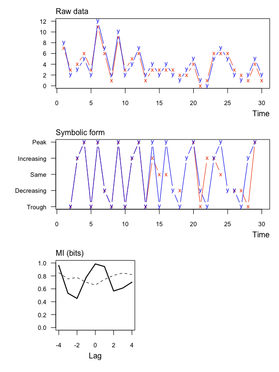

muti
====

`muti` is an `R` package that computes the mutual information (MI) between two discrete random variables *X* and *Y*.

You can install the development version with

    if(!require("devtools")) {
      install.packages("devtools")
      library("devtools")
    }
    devtools::install_github("mdscheuerell/muti")

Background
----------

MI is the amount of information about one variable contained in the other; it can be thought of as a nonparametric measure of the covariance between the two variables. MI is a function of entropy, which is the expected amount of information contained in a variable. If *P*(*X*) is the probability mass function of *X*, then the entropy of *X* is

*H*(*X*) = E\[-ln(P(X))\].

The MI between *X* and *Y* is then

MI(*X*,*Y*) = *H*(*X*) + *H*(*Y*) - *H*(*X*,*Y*)

where *H*(*X*,*Y*) is the joint entropy between *X* and *Y*.

Data discretization
-------------------

`muti` computes MI based on 1 of 2 possible discretizations of the data:

1.  **Symbolic**. In this case the *i*-th datum is converted to 1 of 5 symbolic representations (*i.e.*, "peak", "decrease", "same", "trough", "increase") based on its value relative to the *i*-1 and *i*+1 values (see [Cazelles 2004](https://doi.org/10.1111/j.1461-0248.2004.00629.x) for details). Thus, the resulting symbolic vector is 2 values shorter than its original vector. For example, if the original vector was `c(1.2,2.1,3.3,1.1,3.1,2.2)`, then its symbolic vector for values 2-5 would be `c("increase","peak","trough","peak")`.

2.  **Binned**. In this case each datum is placed into 1 of *n* equally spaced bins. If the number of bins is not specified, then it is calculated according to Rice's Rule whereby `n = ceiling(2*length(x)^(1/3))`.

Examples
--------

The primary output of `muti` is a data frame with the MI and associated critical value at different lags. Additionally, `muti` produces plots of the original data, symbolic data (if that option is chosen), and the MI values and associated critical value at different lags.

### EX 1: 2 random variables as symbolic

Here's a case where there should be very little mutual information between *X* and *Y*.

``` r
set.seed(123)
TT <- 30
x <- rnorm(TT)
y <- rnorm(TT)
muti(x,y)
```


    ##       lag      MI_xy     MI_ci
    ##  [1,]  -4 0.06800523 0.3537884
    ##  [2,]  -3 0.02230546 0.3672606
    ##  [3,]  -2 0.02816403 0.3300176
    ##  [4,]  -1 0.04561370 0.3298602
    ##  [5,]   0 0.06997917 0.3306153
    ##  [6,]   1 0.10937351 0.3235016
    ##  [7,]   2 0.09965162 0.3544732
    ##  [8,]   3 0.02230546 0.3719128
    ##  [9,]   4 0.06044060 0.3726831

### EX 2: 2 correlated variables as symbolic

Here's a case where there should be significant mutual information between *X* and *Y*.

``` r
y <- x + rnorm(TT,0,0.5)
muti(x,y)
```



    ##       lag     MI_xy     MI_ci
    ##  [1,]  -4 0.4152936 0.3692989
    ##  [2,]  -3 0.3398746 0.3513658
    ##  [3,]  -2 0.1608100 0.3795003
    ##  [4,]  -1 0.3386468 0.3534330
    ##  [5,]   0 0.3985352 0.3092976
    ##  [6,]   1 0.3613144 0.2958739
    ##  [7,]   2 0.2531284 0.2957751
    ##  [8,]   3 0.1938644 0.3603412
    ##  [9,]   4 0.1932648 0.3154650

### EX 3: 2 correlated variables with binning

Same as above with regular binning instead of symbolic (*i.e.*, `sym=FALSE`).

``` r
muti(x,y,sym=FALSE)
```


    ##       lag     MI_xy     MI_ci
    ##  [1,]  -4 0.3224510 0.4511267
    ##  [2,]  -3 0.3748662 0.4254074
    ##  [3,]  -2 0.3896359 0.4304526
    ##  [4,]  -1 0.3161280 0.4187598
    ##  [5,]   0 0.4715160 0.4048228
    ##  [6,]   1 0.4185081 0.3976365
    ##  [7,]   2 0.3396246 0.4442861
    ##  [8,]   3 0.4786884 0.4239227
    ##  [9,]   4 0.3313601 0.4410315
